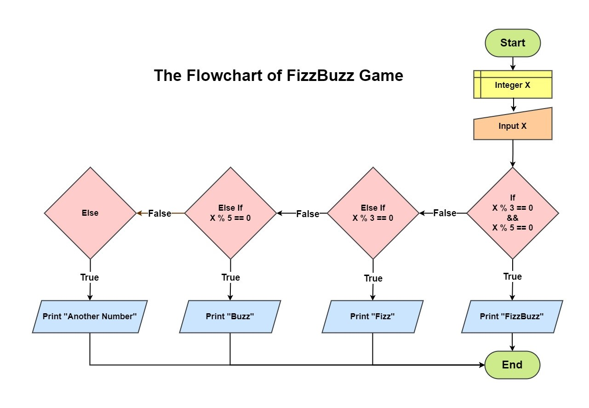

# Fizz Buzz
> Fizz buzz is a group word game for children to teach them about division.
> Players take turns to count incrementally,
> replacing any number divisible by three with the word "fizz",
>  and any number divisible by five with the word "buzz",
>  and any number divisible by both 3 and 5 with the word "fizzbuzz".

### For example:
`1, 2, Fizz, 4, Buzz, Fizz, 7, 8, Fizz, Buzz, 11, Fizz, 13, 14, Fizz Buzz, 16, 17, Fizz, 19, Buzz, Fizz, 22, 23, Fizz, Buzz, 26, Fizz, 28, 29, Fizz Buzz, 31, 32, Fizz, 34, Buzz, Fizz, ...`

---
### Pseudocode & Flowchart

```pseudocode
Var Integer x
x = input(x)

If (x % 3 == 0 && x % 5 == 0)
    Print "FizzBuzz"
Else If (x % 3 == 0)
    Print "Fizz"
Else If (x % 5 == 0)
    Print "Buzz"
Else
    Print "Try Another Number"
End if
```
---

